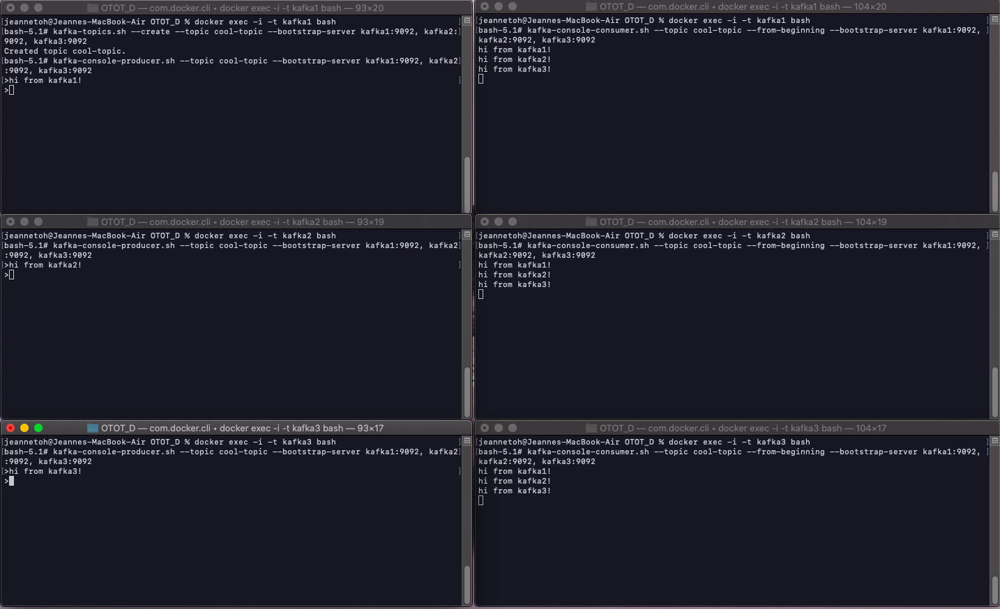
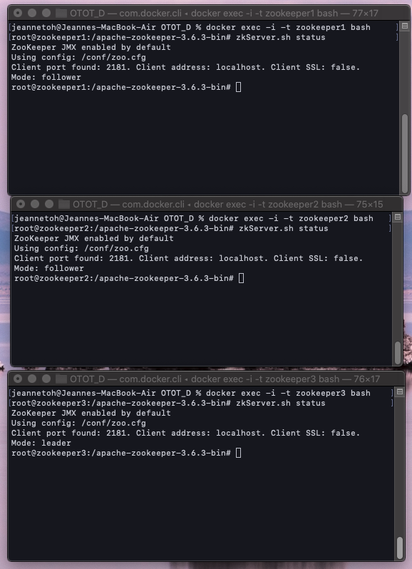
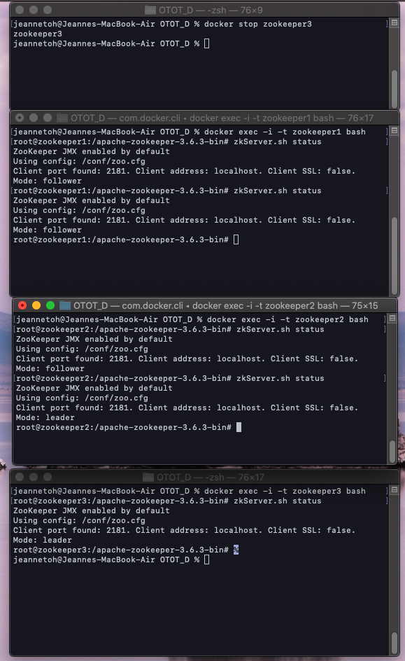

# Task D: Pub-Sub Messaging

## To set up and run the Kafka cluster

1. Clone this repository
2. Run `docker-compose up -d` in the root of the project directory

## Pub-Sub messaging system using Apache Kafka

### 1. Open a bash in a running kafka docker container

Run `docker exec -i -t <container_name> bash`. 

For example:

```shell script
docker exec -i -t kafka1 bash
```

The above command opens a bash in the kafka1 docker container.

### 2. Create a topic

In the bash, run `kafka-topics.sh --create --topic <topic_name> --bootstrap-server <servers_to_connect_to>`

For example:

```shell script
kafka-topics.sh --create --topic awesome-topic --bootstrap-server kafka1:9092, kafka2:9092, kafka3:9092
```

### 3. Create a publisher and publish messages to the topic

In the bash, run `kafka-console-producer.sh --topic <topic_name> --bootstrap-server <servers_to_connect_to>`

For example:

```shell script
kafka-console-producer.sh --topic awesome-topic --bootstrap-server kafka1:9092, kafka2:9092, kafka3:9092
```

You can now publish messages to the topic by typing in the session.


### 4. Create a subscriber to view messages published in the topic

In another console, open another bash in the same kafka docker container (see Step 1).

To create a subscriber in this bash, run `kafka-console-consumer.sh --topic <topic_name> --from-beginning --bootstrap-server <servers_to_connect_to>`

For example:

```shell script
kafka-console-consumer.sh --topic awesome-topic --from-beginning --bootstrap-server kafka1:9092, kafka2:9092, kafka3:9092
```

The subscriber should now be able to view the messages published in the topic.


### 5. Create more publishers and subscribers on the other kafka nodes.

Repeat steps 1, 3 and 4 on kafka docker containers 'kafka2' and 'kafka3'. 

All publishers should be able to publish to the same topic and all subscribers should be able to view messages from all publishers in the topic now.

### Summary

Below is an image capturing the set up and run described above.




## Management of the failure of the master node in the cluster

### 1. Open a bash in each of the running zookeeper docker containers

Run `docker exec -i -t <container_name> bash`. 

For example:

```shell script
docker exec -i -t zookeeper1 bash
```

The above command opens a bash in the zookeeper1 docker container.

### 2. Check the status of each of the zookeeper

Run the following command in each of the zookeeper docker containers:

```shell script
zkServer.sh status
```

The master node should indicate 'Mode: leader', while the other nodes will indicate 'Mode: follower'. 



In the screenshot above, zookeeper3 is the master node while the other 2 zookeeper nodes are followers.

### 3. Simulate the failure of the master node

To simulate the failure of the master node, in a separate console run `docker stop <master_node_container_name>`.

Example:

```
docker stop zookeeper3
```

### 4. Check for the new master node

Repeat step 2 on the remaining 2 zookeeper containers to identify the new master node.



From the simulation above, you can see that after zookeeper3 (the initial master node) fails, one of the followers (zookeeper2) was promoted to become the new master node.


## Tear Down

Tear down in the following order:
- To exit any publisher/subscriber sessions: press `Ctrl` + `c`
- To exit any bash session in a docker container: press `Ctrl` + `d`
- To close and remove the docker containers: run `docker-compose down`
- To exit your terminal: run `exit`